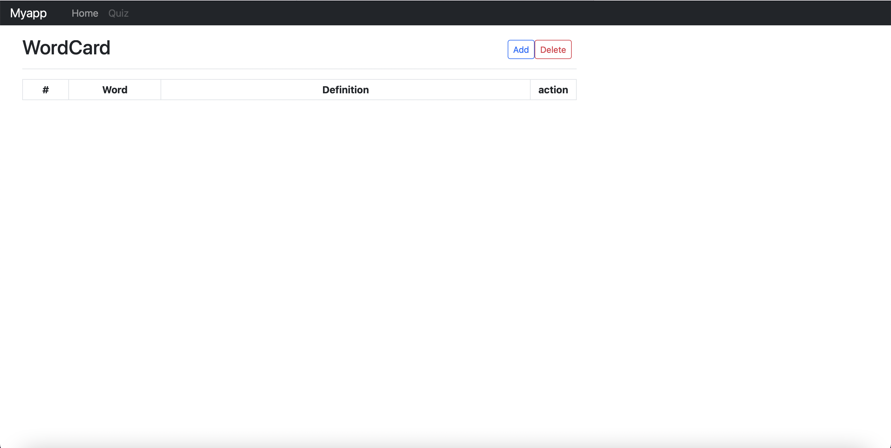
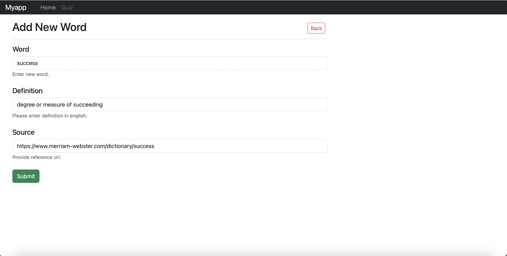
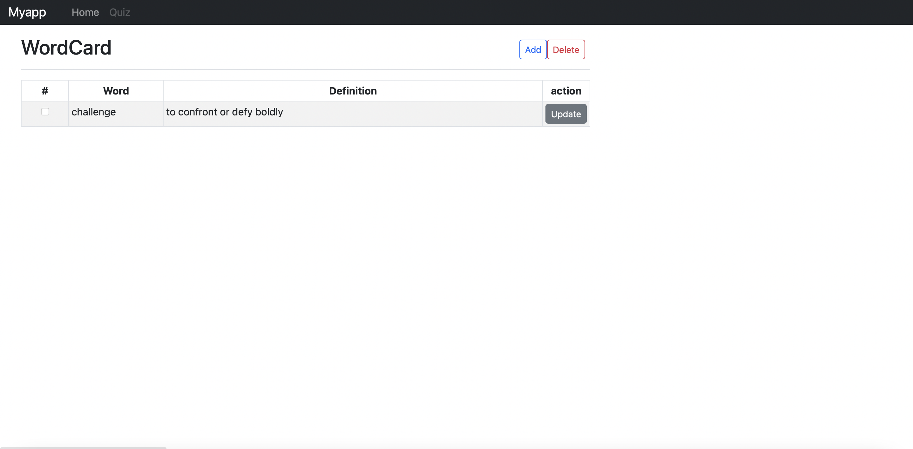
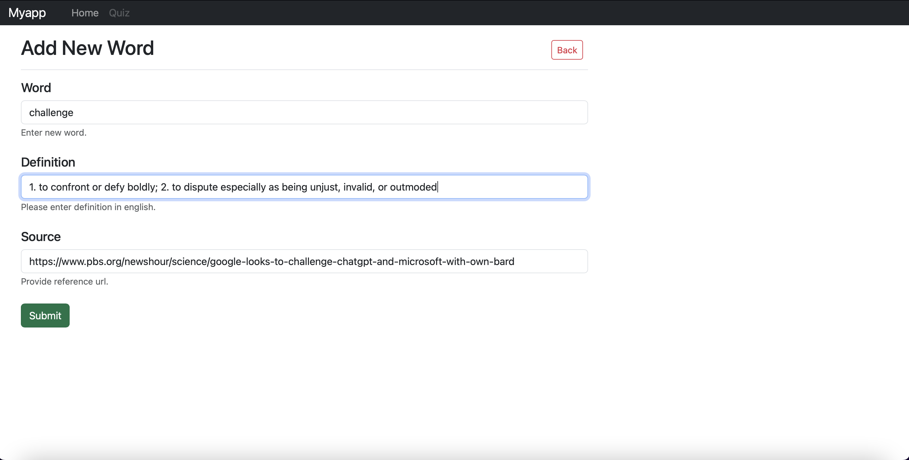
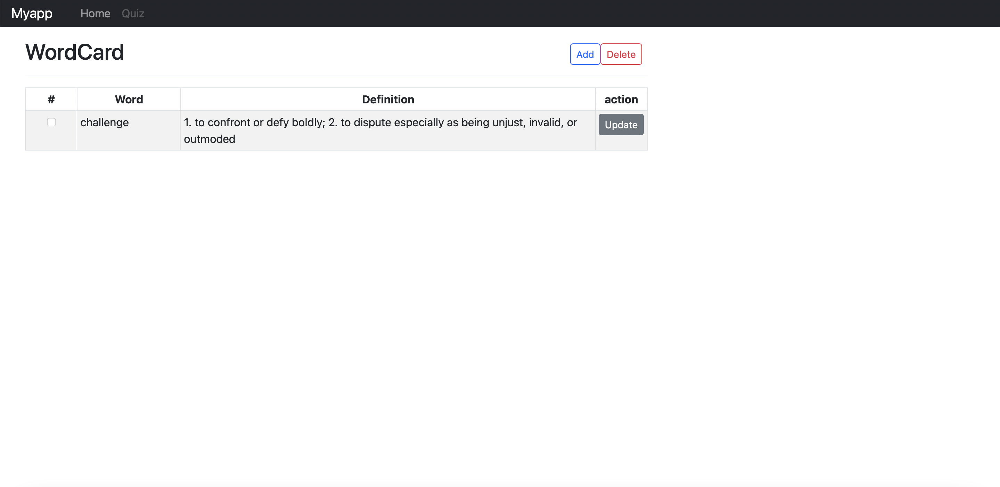
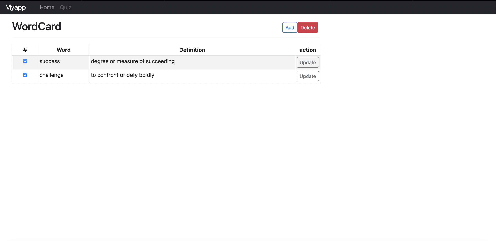

# Using Python Flask to build English glossary Web api
In this repository, I would show database CRUD processes in English glossary project.

## Index page

## Add new word

## Update the word

## Delete words in bulk

